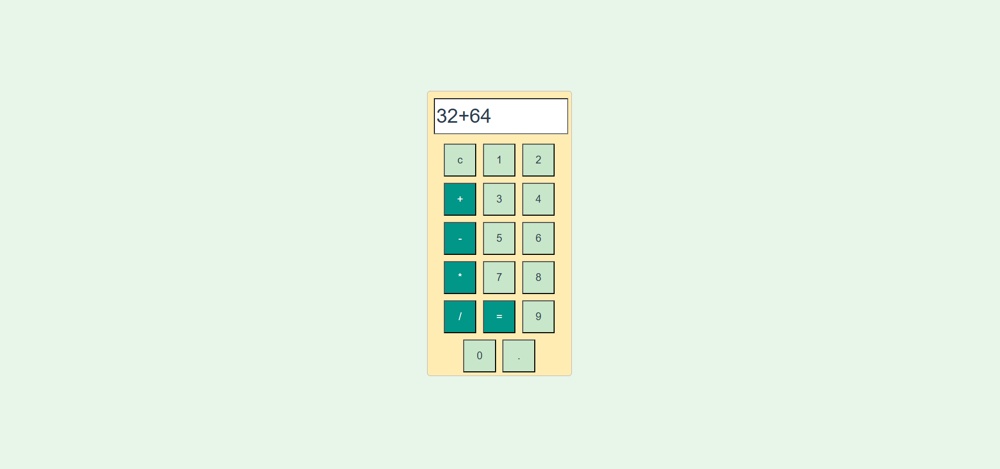

<h1 align="center">🎨✨ Colorful Calculator ✨🎨</h1>

<p align="center">
  🧮 A vibrant, responsive calculator built with <strong>HTML</strong>, <strong>CSS</strong>, and <strong>JavaScript</strong>.<br>
  💡 Clean logic meets colorful design — perfect for learning, fun, or daily calculations!
</p>

<p align="center">
  
  
  
</p>

---

## 🌈 Why You'll Love It

- ⚡ **Fast & Interactive** – Instant calculation with real-time input
- 🎨 **Eye-Catching Colors** – Dynamic UI with hover animations
- 🧠 **Smart Logic** – Handles all basic operations with clean JavaScript
- 📱 **Responsive Design** – Works beautifully on all screen sizes
- 🎭 **Theme-Ready** – Easy to tweak and restyle the color palette

---

## 🚀 Live Demo

> 🚀 Live here:




---

## 🛠 Tech Stack

| Language      | Purpose                     |
|---------------|-----------------------------|
| 💻 HTML5       | Structure & layout           |
| 🎨 CSS3        | Styling, gradients, animation|
| 🧠 JavaScript | Core logic & interactivity   |

---

## 🧾 Features Overview

✅ Responsive Grid-Based Layout  
✅ Dark/Light Vibe with Smooth Transitions  
✅ Button Hover & Press Effects  
✅ Display Overflow Management  
✅ Intuitive Keyboard Support (Optional)

---

## 🗂️ Project Structure

```bash
📁 Calculator/
├── 📄 index.html       # Structure & buttons
├── 🎨 style.css        # Visual design and effects
└── 🧠 script.js        # Math logic and functionality
📦 Getting Started
Clone the repo & start using it locally:git clone https://github.com/SahilRajput47/calculator.git
cd Calculator
open index.html

🤝 Contribute With Style
Want to add themes, improve accessibility, or make it smarter?

🎉 Pull requests are welcome!
✨ Add your own flair to make this calculator even more fabulous!

💬 Let’s Connect
📧 Email: karanrajput4580@gmail.com
📷 Instagram: @sahil_rajput.74

📄 License
This project is under the MIT License. Use it, improve it, and share it freely. 💖
🔥 “Code is poetry. Colors are emotions. Let your calculator shine!”
— Made with ❤️ by SahilRajput47

---

Let me know if you'd like a **fancy animated calculator UI**, **dark/light mode toggle**, or **keyboard input support** — I can help you add those features too!
